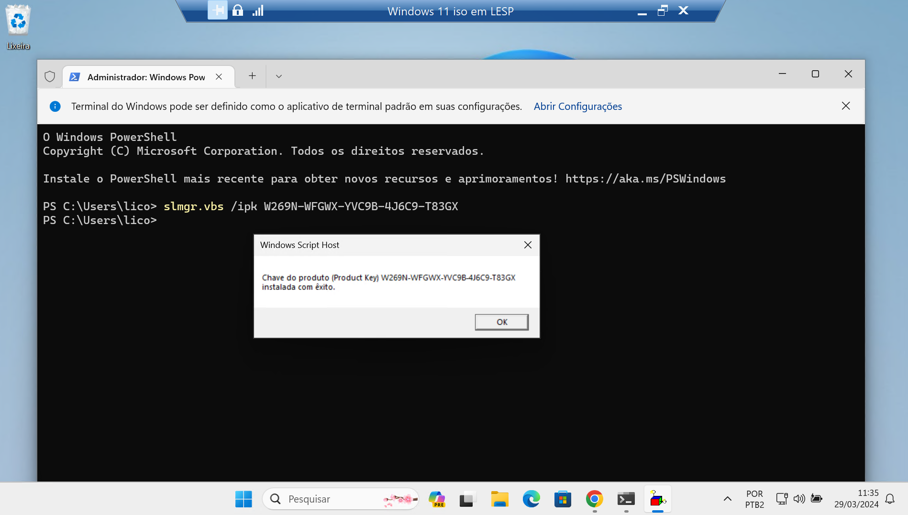

# Ativação do Windows 11


> Passo 1: Acessar o terminal como administrador

> Passo 2: Colar o comando abaixo e digitar enter
```
slmgr /ipk W269N-WFGWX-YVC9B-4J6C9-T83GX
```
Then you Enter

Passo 3: Você copia e cola este código “slmgr /skms kms8.msguides.com”. Então você entra para se conectar ao meu servidor KMS.

```
slmgr /skms kms8.msguides.com
```
Passo 5: O último passo é ativar o seu Windows você usa o comando “slmgr /ato” e enter.

```
slmgr /ato
```



https://gist.github.com/Minionguyjpro/d913b3931e844ad8ad9a758a4aca4b63