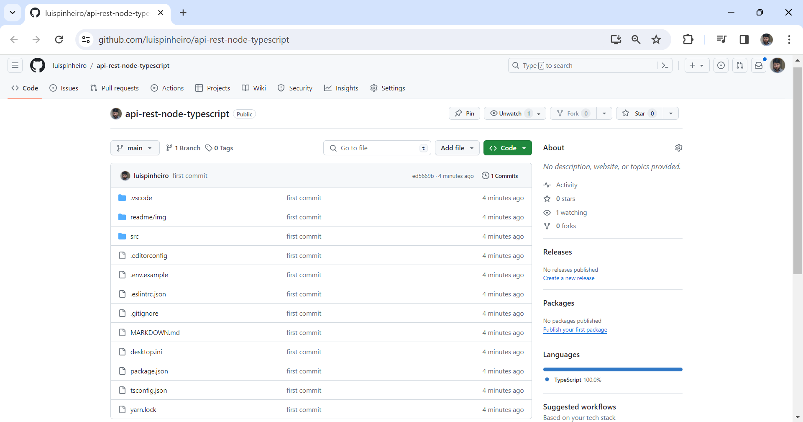

# Git e Github

# Criando um projeto e versionando automaticamnte após as configurações de usuário

> Após iniciar um projeto dentro do diretório desejado acessar o ícone lateral do git Source control, clicar em "Publish to Git"

> Abrirá duas opções no campo de pesquisa superior para pulbicar o projeto publico ou privado

Ao escolher uma das opções o projeto mostrará no canto inferior direito um botão Open on GitHub

> Ao clicar no botão o projeto já criará um repositório remoto automaticamente no site do GitHub.

