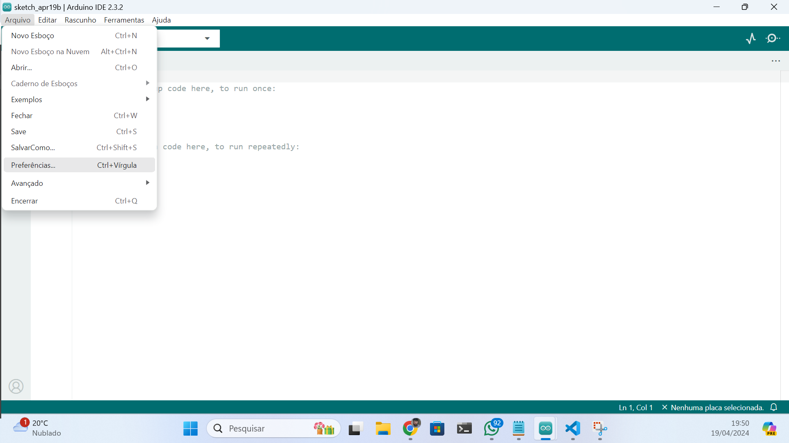
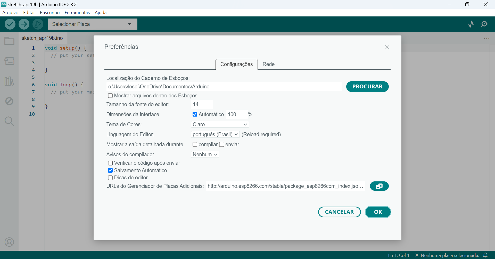
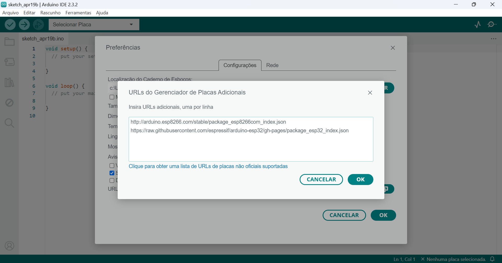
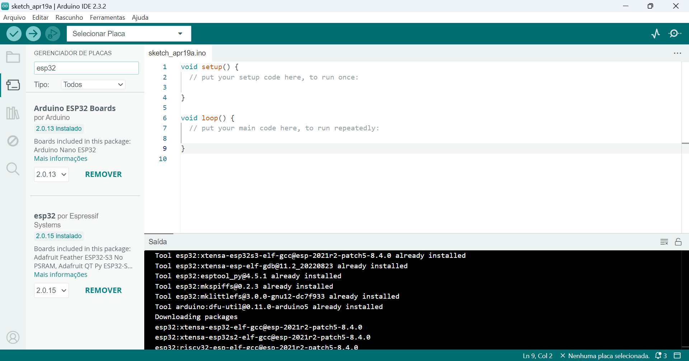
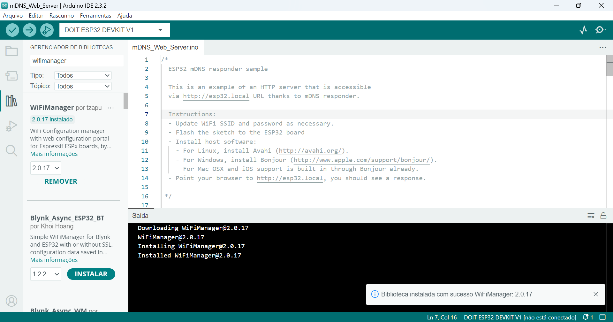

# ESP32 e ESP8266

## Instalação e Configuração

> Após a instalação da IDE Arduino

http://arduino.esp8266.com/stable/package_esp8266com_index.json

https://raw.githubusercontent.com/espressif/arduino-esp32/gh-pages/package_esp32_index.json

## Biblioteca WifiManager

