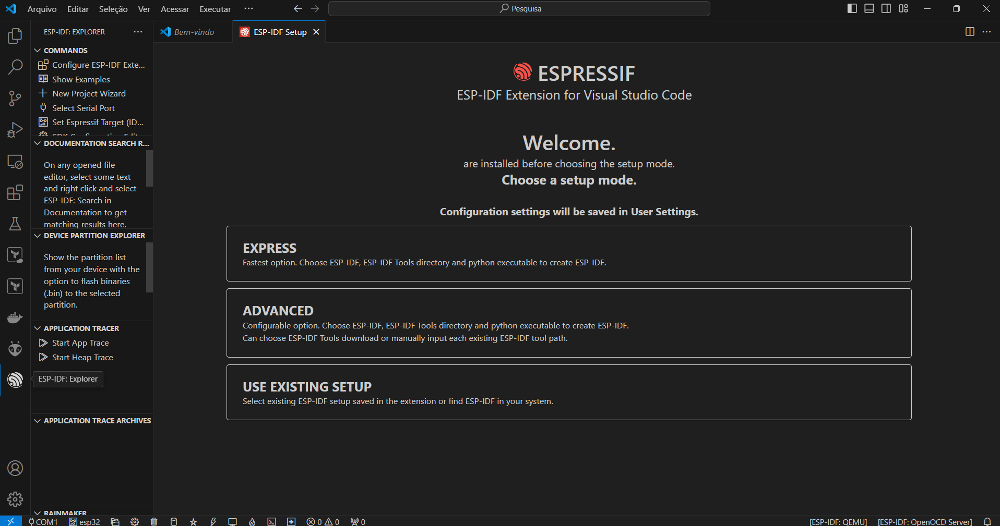
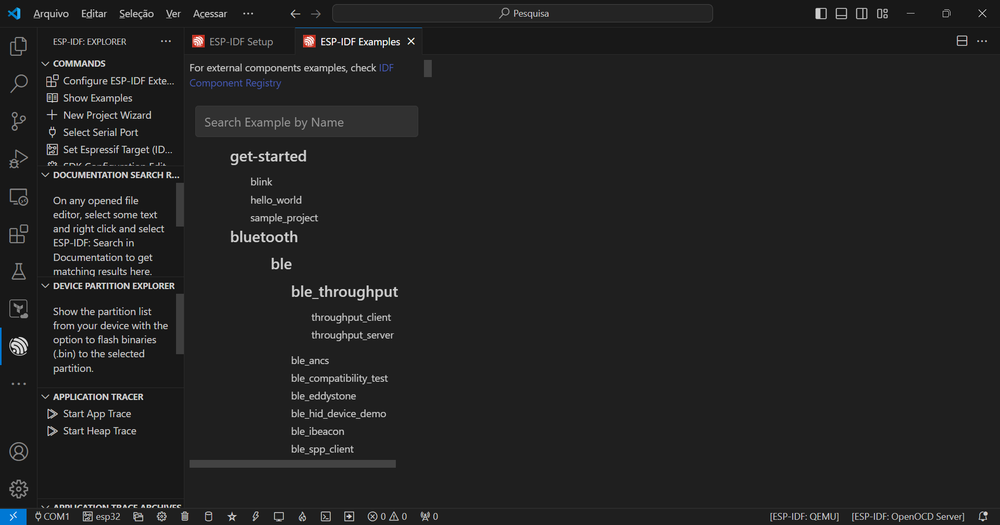
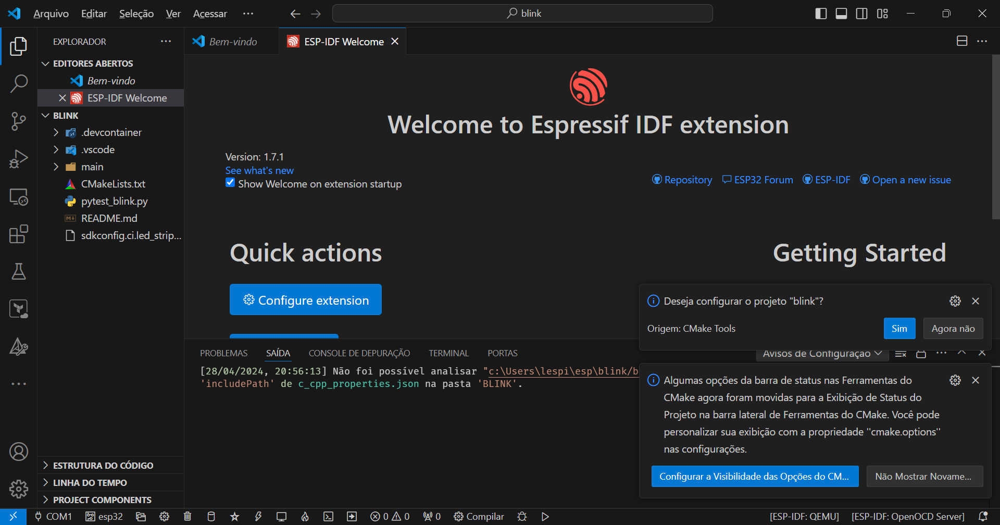
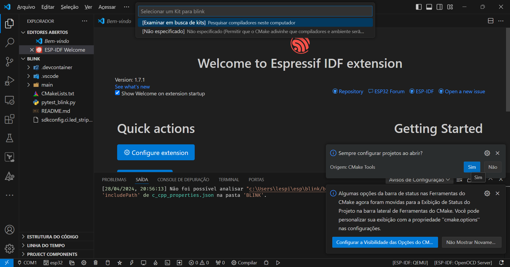

# Instalação, configuração e operação do framework ESP-IDF da Espressif

## Espressif

Empresa multinacional sediada em Xangai, foi fundada em 2008, focada no desenvolvimento de soluções de comunicação sem fio. Desenvolvedora dos microcontroladores ESP8266 e Esp32.

## TSMC

Taiwan Semiconductor Manufacturing Company (TSMC) é uma empresa multinacional Tailandesa de fabricação de semicondutores. Embora os microcontroladores ESP8266 e ESP32 tenham sido criados e desenvolvidos pela Espressif Sistemas os processadores Tensilica Xtensa LX6 são fabricados pela TSMC usando seus processo de fabricação de 40 nm.

## FreeRTOS - (Real-time operating system for microcontrollers)

 É um sistema operacional de tempo real líder de mercado para microcontroladores e pequenos microprocessadores. Distribuído gratuitamente sob a licença de código aberto do MIT, o FreeRTOS inclui um kernel e um conjunto crescente de bibliotecas IoT adequadas para uso em todos os setores da indústria. O FreeRTOS foi desenvolvido com ênfase na confiabilidade e facilidade de uso.

## Sites importantes sobre o tema

> https://docs.espressif.com/projects/esp-idf/en/stable/esp32/get-started/index.html

> https://www.espressif.com/

> https://www.freertos.org/index.html

> https://pt.aliexpress.com/store/1100220184

## ESP-IDF

O ESP-IDF é o framework oficial da Espressif para o desenvolvimento de aplicações parar toda a família ESP32.

### Instalação no VSCode

> Procurar pela extensão ESP-IDF e instalar

Acessar no menu o ícone da Espressif

> Outra maneira é acessar a paleta de comandos  Ctrl+Shift+p

> Escolher Express

> Caso o diretório do usuário esteja com acentos, espaços ou caracteres especiais não é recomendado instalar no diretório sujerido. Instalar sem escolher a versão e colocarem outro diretório pode ocasionar erros conforme abaixo.

> Procurar a última versão estável

> Segunda etapa a instalação do Toolchain

> Conectar a placa e verificar a porta de conexão

> Exemplos

> Abrir o programa Menu config

> Escolher o pino desejado do GPIO

> USB não encontrada no console

>Clicar no menu abaixo para escolher a porta de comunicação

> Build

> Flash na barra - enviar o firmware para a memória do Esp32

## Lib ESP32 3.0 Arduino IDE

> A Lib 2.0 da Espressif para  IDE Arduino terá suporte somente até julho de 2024.(incluindo suporte para ESP32-C6 e ESP32-H2)

- https://docs.espressif.com/projects/arduino-esp32/en/latest/migration_guides/2.x_to_3.0.html

- https://blog.espressif.com/announcing-the-arduino-esp32-core-version-3-0-0-3bf9f24e20d4

### Atualizando

