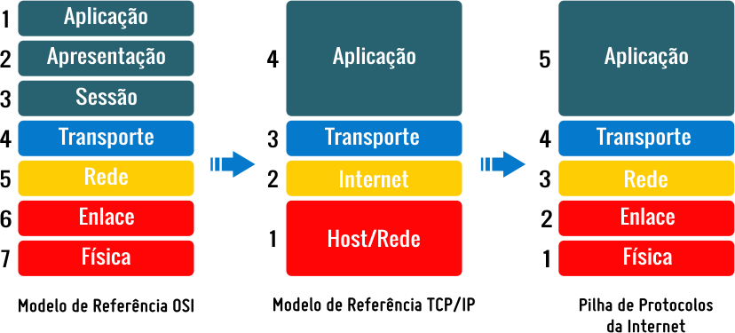
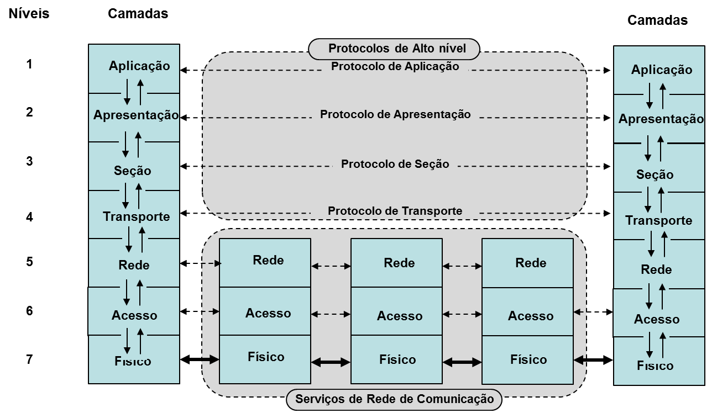

# Evolução dos protocolos de internet e da pilha TCP/IP e IOT

# História do `TCP/IP`

O conjunto de protocolos de comunicação foi desenvolvido em 1969, no Departamento de Defesa dos Estados Unidos. Ele fez parte do projeto conhecido como ARPANET que ao longo dos anos se transformou em Internet.
Um dos primeiros testes do protocolo TCP/IP ocorreu em 1975, entre a Universidade de Stanford, nos Estados Unidos, e a University College London, na Inglaterra.
Ao longo das décadas seguintes, o desenvolvimento da tecnologia se juntaria a outros avanços, como a criação do HTTP, para a formação da Internet tal qual ela é conhecida hoje: uma rede mundial de computadores trocando dados e informações de maneira incessante.

## Modelo `OSI` (Open Systems Interconnection)  e `TCP/IP` (Transmission Control Protocol/Internet Protocol)

O Modelo TCP/IP tem o mesmo objetivo do Modelo OSI, que é a de definir um modelo padrão de camadas para a implementação de camadas na arquitetura da rede. 

### `A Camada de Aplicação`

A camada de aplicação refere-se aos programas e protocolos que o TCP/IP deve utilizar para iniciar a transmissão de dados.

Fazendo um paralelo com um serviço postal, a camada de aplicação seria o momento de escolher qual serviço você quer utilizar dependendo do elemento que deseja enviar. Por exemplo, você pode contratar os serviços dos Correios para enviar um telegrama ou uma transportadora para enviar uma caixa.

No universo digital não é diferente: um navegador de Internet pode utilizar protocolos como o HTTP e o HTTPS para realizar a comunicação a partir das URLs. Enquanto isso, um cliente de transferência de arquivos, como o FileZilla, utiliza o protocolo FTP. Já um serviço de email geralmente utiliza o protocolo SMTP.

pagina principal do gmail
Em outras palavras, a camada de aplicação existe para que o TCP/IP defina qual o tipo ou finalidade daquela transmissão de dados específica, seja ela o carregamento de um site, o upload de arquivo ou o envio de um email, por exemplo. A partir desta definição, o processo é encaminhado para as camadas seguintes.

### `Camada de transporte`

A camada de transporte refere-se ao Protocolo de Controle de Transmissão (TCP) da sigla TCP/IP. Ela é que define como os dados serão transmitidos entre as duas partes do processo cliente/servidor.

A camada de transporte seria a preparação do seu pacote para envio: o serviço define qual meio de transporte será utilizado e como o pacote será embalado para que chegue no seu destino intacto, entre outras medidas.

Para isso ela estabelece os canais de comunicação de transferência de dados, todos eles independentes dos hosts e responsáveis por garantir que cada byte que compõe os dados em questão serão transmitidos de forma íntegra, os dados são divididos em pacotes e numerados, criando uma sequência lógica que será verificada nas camadas seguintes para garantir que o processo seja concluído, definindo para onde os dados devem ser enviados e a que taxa essa transferência deve ser realizada.

Portas TCP
Para realizar esse processo, o TCP usa as chamadas portas, elementos numéricos que identificam os pontos de uma transferência de dados. As portas são sempre utilizadas em conjunto com um endereço de rede (como o endereço IP, sobre o qual falaremos mais abaixo).

Por serem identificadas numericamente num padrão de 16 bits, as portas vão do 0 até o 65535. Alguns números de portas são universalmente utilizados para determinados processos. Por exemplo:

Porta 20: transferência de dados via FTP
Porta 21: controle de comando FTP
Porta 22: login SSH (Secure Shell)
Porta 25: recebimento de emails via SMTP
Porta 53: serviço de DNS (Sistema de Nomes de Domínio)
Porta 80: transferências HTTP
Porta 443: transferências HTTPS (via TLS/SSL)
Vale notar que, embora o TCP seja o protocolo mais utilizado na camada de transporte, outros protocolos também podem ser utilizados. Podem ser citados como exemplo o SCTP (Stream Control Transmission Protocol) e o UDP (User Datagram Protocol).

### `A Camada de Rede (IP)`

No paralelo com o serviço postal, a camada de rede — também conhecida como camada de Internet — é responsável por dar o sinal verde final para o envio do seu pacote. 

Em linguagem mais técnica, essa camada lida com as interfaces dos hosts e transforma os pacotes de dados em datagramas. Cada datagrama possui dois componentes principais: um cabeçalho (header), contendo o endereço IP da origem e do destino e outros dados relevantes, e a carga útil (payload), que contém os dados em si que estão sendo enviados.

Aqui, vale fazer a distinção entre IP e endereço IP. IP, ou Protocolo de Internet, é o conjunto de regras e definições que permite que os dados sejam enviados entre computadores e servidores conectados ao redor do mundo. 

O endereço IP, por outro lado, é um elemento específico, utilizado para identificar numericamente cada host envolvido no processo de transferência — garantindo, desta forma, que os dados saiam do lugar certo e cheguem ao lugar certo, da mesma forma que um endereço doméstico para uma transportadora.

Além do protocolo IP, a camada de rede também utiliza o protocolo ICMP (Protocolo de Mensagens de Controle da Internet), responsável por fornecer relatórios de erros às fontes de envio de dados. Desta forma, caso haja algum problema na comunicação entre os hosts, a mensagem definirá qual foi o erro ocorrido e ajustes poderão ser realizados para completar o processo de maneira bem-sucedida.

### `A Camada de Interface`

Por fim, a camada de interface — também chamada de camada de enlace de dados ou ligação de dados — lida com a transferência em si dos dados entre os hosts. Ou seja, finalizando o paralelo com o serviço postal, trata-se do envio de fato do seu pacote ao destinatário.
A camada de interface é responsável, entre outros aspectos, por definir como os dados serão transmitidos, seja por uma conexão cabeada (como Ethernet, por exemplo) ou sem fios (como uma rede Wi-Fi).

" Leituras Sugeridas
Como Configurar um Firewall no Ubuntu com UFW
Como Configurar Port Forwarding em um Servidor Minecraft no Windows, macOS e Linux
O que é SSL / TLS e HTTPS? "

### Datagrama

A RFC 1594 define o termo datagrama da seguinte forma: “Uma entidade independente e autocontida de dados que transporta informações suficientes para serem roteadas da origem ao computador de destino sem depender de trocas anteriores entre este computador de origem e de destino e a rede de transporte”.

Um datagrama é uma unidade de transferência básica associada a uma rede de comutação de pacotes. Os datagramas são normalmente estruturados em seções de cabeçalho e carga útil. Os datagramas fornecem um serviço de comunicação sem conexão em uma rede comutada por pacotes. A entrega, a hora de chegada e a ordem de chegada dos datagramas não precisam ser garantidas pela rede. Cada datagrama possui dois componentes, um cabeçalho e uma carga útil de dados. O cabeçalho contém todas as informações suficientes para o roteamento do equipamento de origem ao destino e a carga útil são os dados a serem transportados. Sem confirmação de entrega ou recebimento.

## Bibliografia

https://www.hostinger.com.br/tutoriais/tcp-ip#Historia_do_TCPIP

https://www.uniaogeek.com.br/arquitetura-de-redes-tcpip/

https://pt.wikipedia.org/wiki/Datagrama#:~:text=de%20itens%20identificados.-,Defini%C3%A7%C3%A3o,e%20a%20rede%20de%20transporte%E2%80%9D.