# Windows Terminal e PowerShell

# Atualizações

> [https://learn.microsoft.com/en-us/powershell/scripting/install/installing-powershell-on-windows?view=powershell-7.4#installing-the-msi-package](https://learn.microsoft.com/en-us/powershell/scripting/install/installing-powershell-on-windows?view=powershell-7.4#installing-the-msi-package)

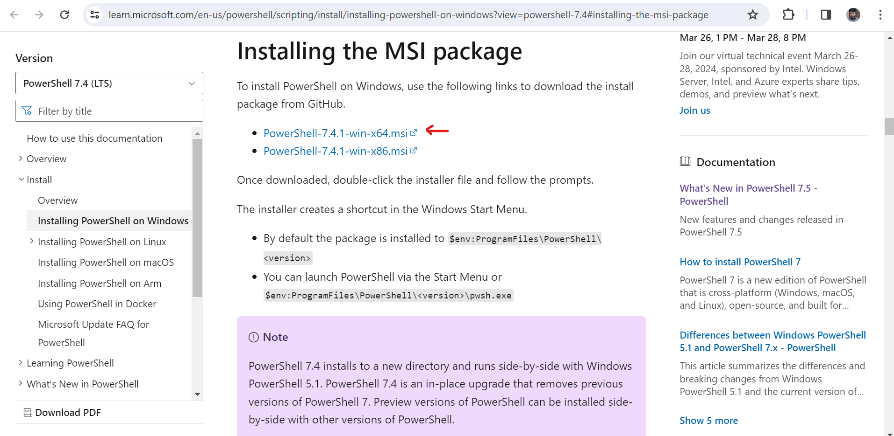

> Outro método de instalação Wget

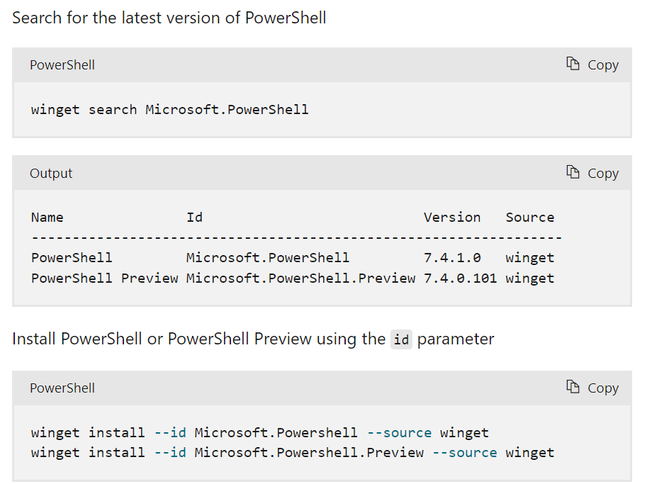

# Temas, ações, atalhos e comandos

[https://learn.microsoft.com/pt-br/windows/terminal/customize-settings/actions](https://learn.microsoft.com/pt-br/windows/terminal/customize-settings/actions)

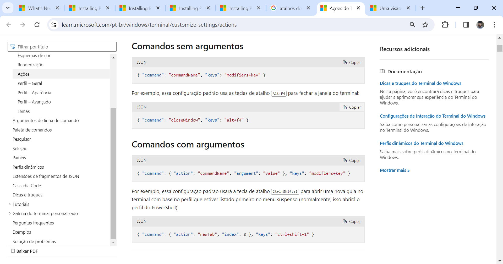

[https://learn.microsoft.com/pt-br/windows/terminal/](https://learn.microsoft.com/pt-br/windows/terminal/)

# Treinamento de Introdução ao Subsistema do Windows para Linux (WSL)

[https://learn.microsoft.com/pt-br/training/modules/wsl-introduction/?source=recommendations]https://learn.microsoft.com/pt-br/training/modules/wsl-introduction/?source=recommendations)

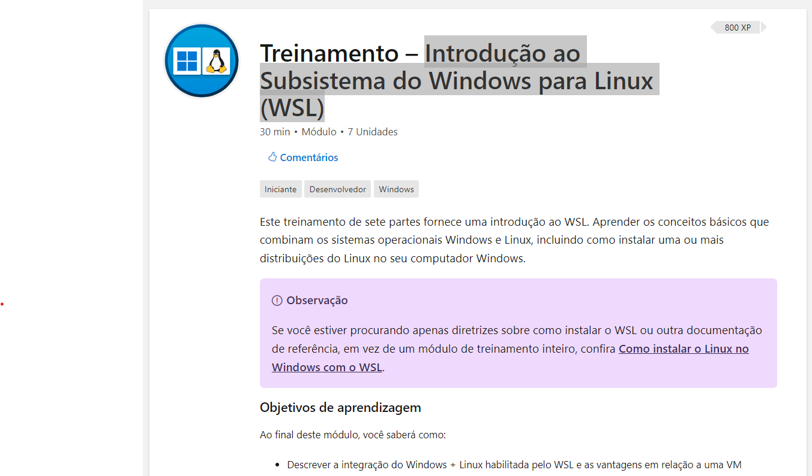

## Desinstalar o Terminal

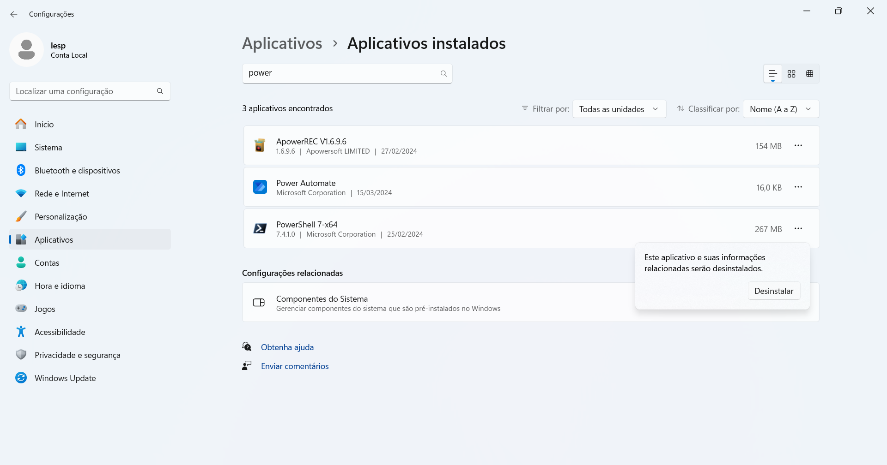

## Desinstalar o Termina PowerShell 

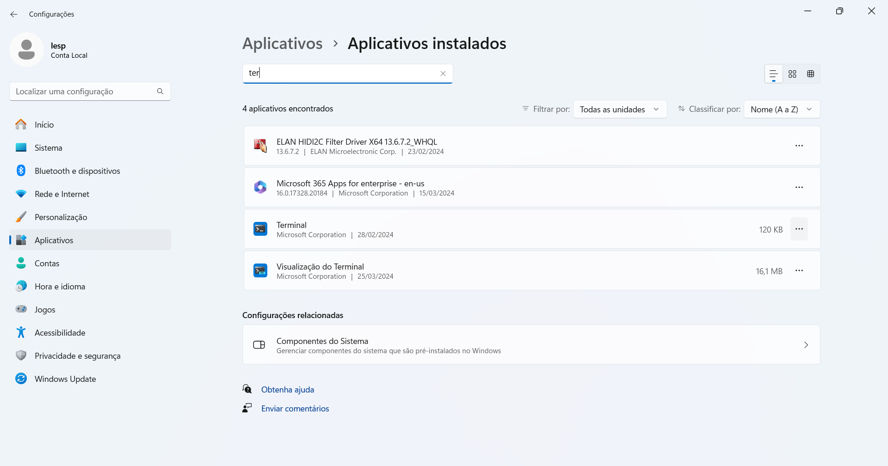

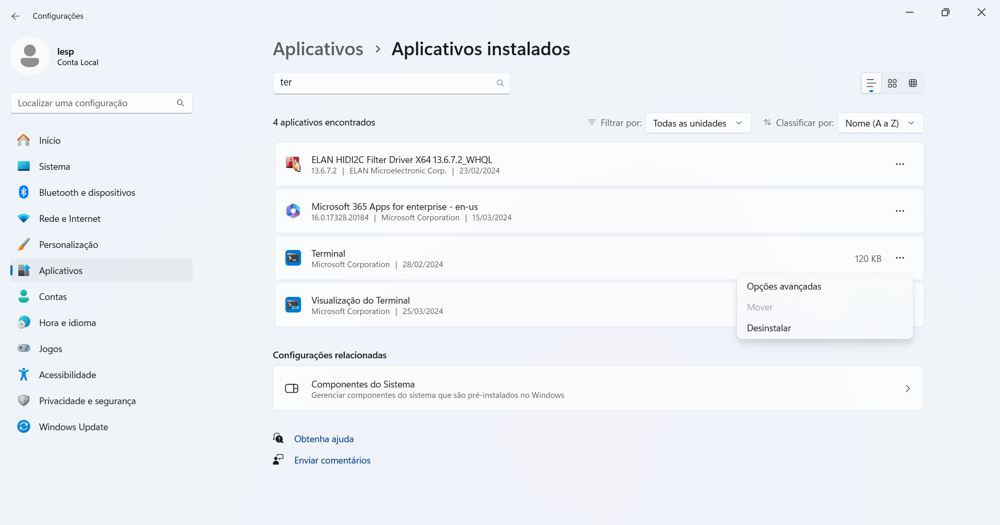

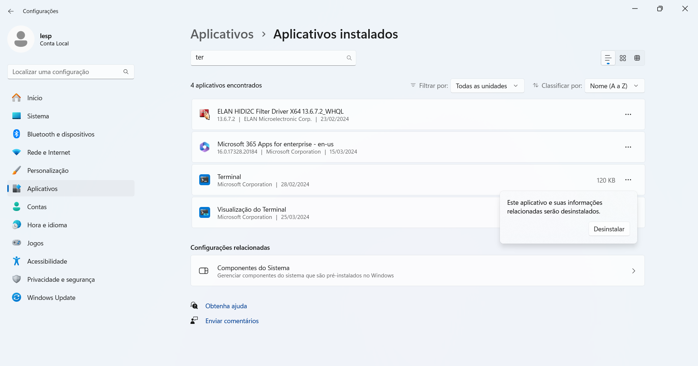

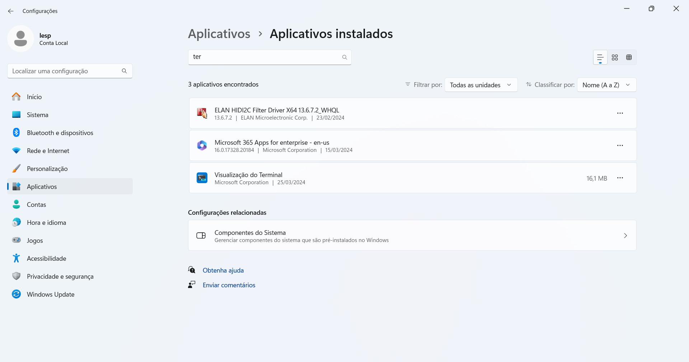

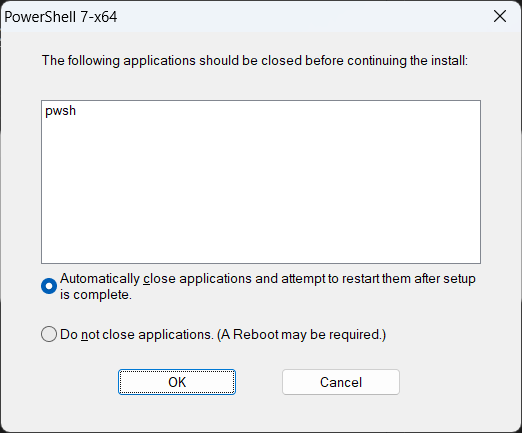

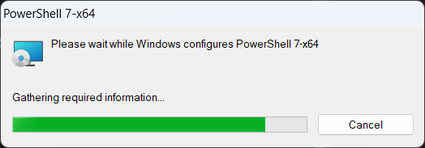

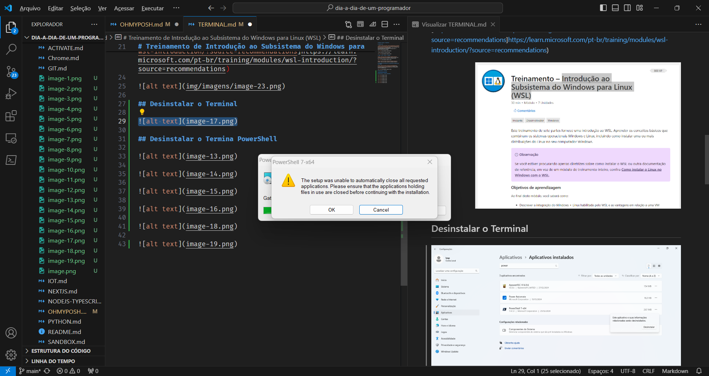

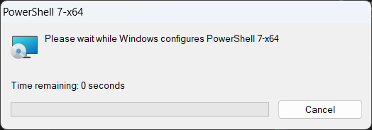

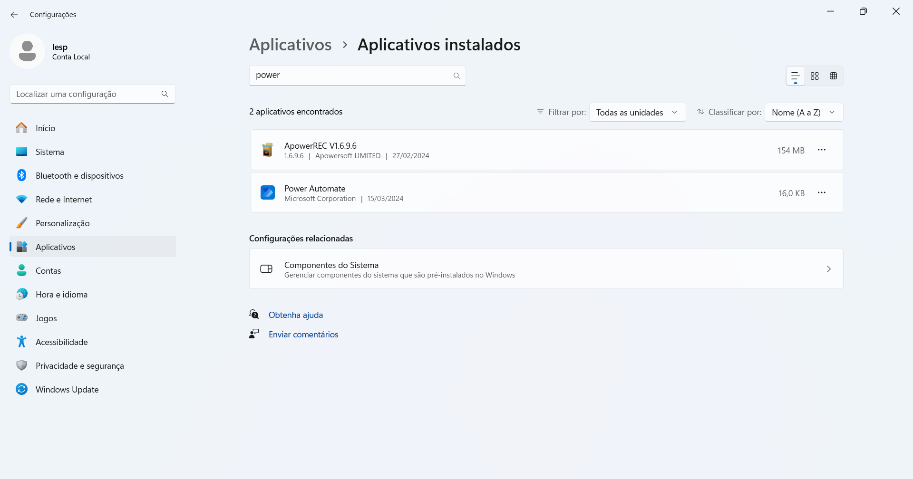