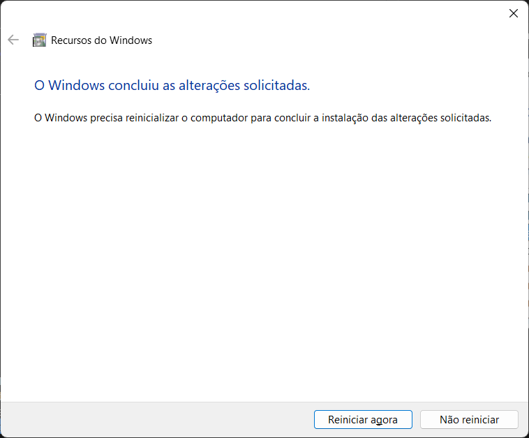
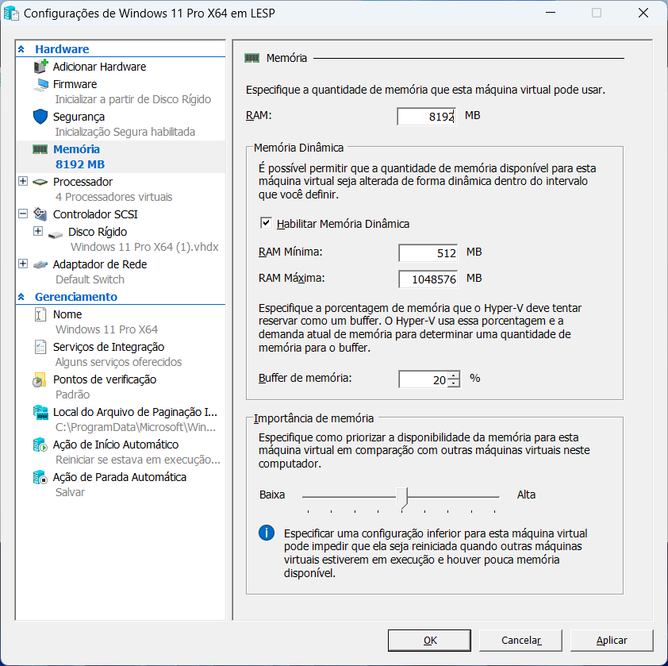
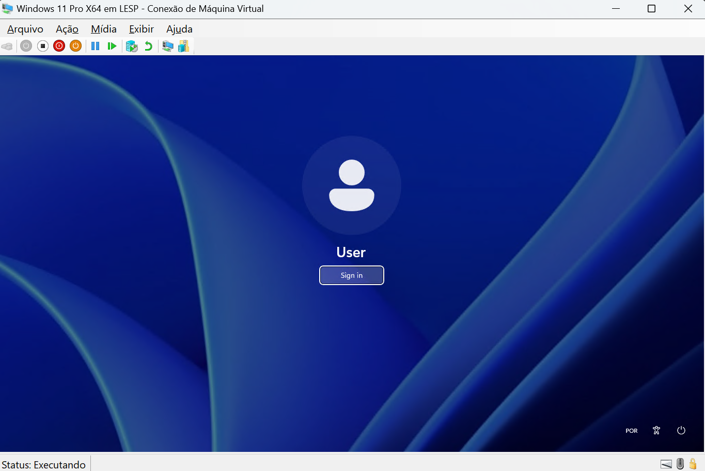

# Como criar uma máquina virtual com o Hyper-V Windows

É possível criar a máquina virtual e o disco juntos, mais abaixo irei criar uma um disco e posteriormente a VM.

> Diretório padrão das VM

> C:\ProgramData\Microsoft\Windows\Virtual Hard Disks

## Criar um disco virtual

> Apertar trecla do Windows e procurar por "Ativar ou desativar recursos do Windows"

> Após a reiniciar o Windows procurar por Hyper-V

# Criar a máquina Virtual com Hyper-V

> Neste caso irei alocar memória dinâmica, pois meu computador tem 32GB

> No Windows 11 é melhor deixar conectado na próxima opção, pois deve precisare da internet.

> Como já existe um disco criado utilizar a opção usar disco rígido e procurar onde ele foi criado.

> Acessar configurações

> Alterar a quantidade de núcleos desejados, por padrão foi utilizado 4 núcleos

> Alterar em Segurança e desabilitar Secure boot

https://www.youtube.com/watch?v=3XMn8JssNxU

Tempo 5:00

> Clicar em Iniciar

> Clicar em conectar

> Erro na inicialização

> Deletar a VM criada possível que a HD não seja da segunda geração

> Instalação sem internet

> desabilitar a placa de rede
com o comando

ncpa.cpl  (tecle enter)   

desabilitar a rede local e depois digitar

oobe\bypassnro (tecle enter)

https://www.youtube.com/watch?v=1rDNMY-dlkc

habilitar a placa de rede ethernet novamente

## <mark>Hyper-V Quick Create/mark>

A melhor maneira de criar uma uma VM com Hyper-V

### VM Ubuntu utilizando a imagem 22.04 padrão fornecida pelo sistema.

> <mark>Não esquecer de modificar o Firmware para o Disco rígido, sendo que ele esta utilizando uma unidade de DVD virtual para rodar a ISO.</mark>

Tempo 15:40 no vídeo abaixo
https://www.youtube.com/watch?v=p6RoEe0CO_Q

## Criando uma instalação do Windows 11 através de Imagem ISO

> No momento que a tela mostrar o botão iniciar é preciso segurar uma tecla porexemplo a espaço, depois clicar no botão iniciar até começar a instalação.

> Eliminando os requisitos para a instalação do Windows 11

> Clicar em shift + F10 para iniciar o cmd e depois digitar regedit para alterar os registros do Hardware, conforme imagem abaixo.

> acessar os registros do windows e criar algumas 

> fecha a janela de registro do Windows e clica em voltar 

Vemos que agora ele pérmite a continuação da formatação.

> Aceitar os termos

### VM Windows utilizando a imagem Ambiente de desen... padrão fornecida pelo sistema.

> Editar Configurações

> Para não inicializar com o Windows do sistema

> Caso tenha problema de boot segura a tecla barra de espaço e deixar precionada até colicar em iniciar.

# Compartilhamento entre maquina Host e Guest

https://www.youtube.com/watch?v=cbwQKR78OMs

